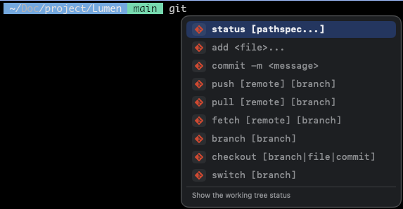
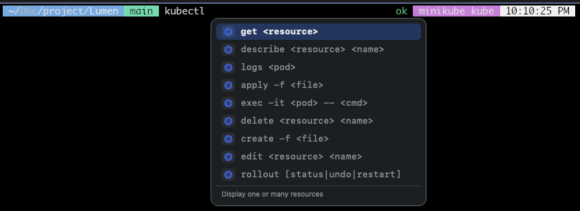
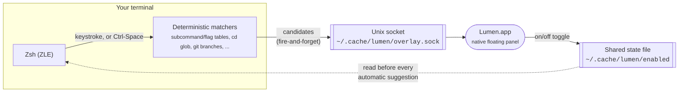

<p align="center">
  
</p>

<h1 align="center">Lumen</h1>

<p align="center"><strong>Deterministic command suggestions for Zsh — inline, on demand, no AI round-trip required.</strong></p>

<p align="center">
  
  
  
  <a href="LICENSE"></a>
</p>

<p align="center">
  <a href="#quick-start">Quick start</a> ·
  <a href="#screenshots">Screenshots</a> ·
  <a href="#features">Features</a> ·
  <a href="#architecture">Architecture</a> ·
  <a href="#installation">Installation</a> ·
  <a href="#usage--keybindings">Usage</a> ·
  <a href="#known-tool-subcommand-coverage">Tool coverage</a> ·
  <a href="#the-lumen-menu-bar-app">Menu bar app</a> ·
  <a href="#troubleshooting">Troubleshooting</a> ·
  <a href="#known-limitations">Known limitations</a> ·
  <a href="#contributing">Contributing</a> ·
  <a href="#license">License</a>
</p>

---

<p align="center">
  
</p>

## Quick start

Two commands and you're suggesting:

```sh
# 1. Wire the plugin into your shell (once — new tabs pick it up automatically after)
echo 'source /path/to/Lumen/shell/zsh/lumen.plugin.zsh' >> ~/.zshrc && source ~/.zshrc

# 2. Build and launch the menu bar app that actually draws the suggestions
cd /path/to/Lumen/Lumen && ./build.sh && open Lumen.app
```

macOS will ask for Accessibility permission on first launch — grant it,
then just start typing: `git che`, `docker ex`, `kubectl get`... For the
full walkthrough (including what to do if that permission prompt gets
missed), see [Installation](#installation).

> **Why not just ask an AI?** Because your shell doesn't need to guess.
> `git`'s subcommands aren't a moving target — they're fixed, known data.
> Lumen looks them up locally instead of round-tripping to a model that
> might hallucinate a flag that doesn't exist.
>
> | | Lumen | AI-based completion |
> |---|---|---|
> | Latency | Instant (local lookup) | A network round-trip, every time |
> | Accuracy on real subcommands | Always correct | Can confidently invent flags |
> | Your keystrokes | Never leave your machine | Sent to a cloud API |

## Screenshots

The floating panel positioned against a real terminal cursor, each row
showing the actual brand icon of the tool it belongs to (see [Known-tool
subcommand coverage](#known-tool-subcommand-coverage)):

<p align="center">
  
  &nbsp;&nbsp;
  
</p>

## Overview

Lumen embeds Fig/Kiro-CLI-style command completion directly into an
existing Zsh session — not a separate terminal emulator, and not an
always-on background process. As you type (or on Ctrl-Space), the Zsh
plugin matches the current buffer against known, hand-picked data — a
tool's subcommands, directories under `cd`, or your repo's own git
branches — and renders the result as a real floating panel via a
companion macOS menu bar app, also called **Lumen**.

There's no AI provider, no daemon, and no network round-trip anywhere in
this path: every suggestion resolves synchronously from local data (a
static table, a directory glob, or `git for-each-ref`), so it's instant
and never wrong about what a tool's own subcommands or your own
branches/directories actually are.

This is a repo with two pieces working together, documented below in one
place: the Zsh plugin (`shell/zsh/`) and the menu bar
overlay app (`Lumen/`, Swift).

## Features

### A panel that stays out of your way

- **Inline, non-intrusive suggestions** — candidates render as a small
  floating card positioned against your terminal cursor; nothing appears
  unless you're actively typing or ask for it.
- **Two trigger modes** — automatic as-you-type suggestions, or Ctrl-Space
  to ask immediately for the current buffer.
- **Scrollable, mouse-friendly panel** — up to 5 rows show at once; longer
  candidate lists scroll (mouse wheel, or Up/Down past the visible range)
  instead of growing the panel indefinitely. Rows also respond to the
  mouse directly — hover to highlight, click to select and accept a
  candidate without stepping through it via Up/Down first.
- **Suggestion chaining** — accepting a suggestion immediately shows what
  typically comes next (e.g. picking `git add ` immediately offers file
  paths), instead of going silent until your next keystroke.
- **Menu bar control** — toggle automatic suggestions on/off from the menu
  bar; the state syncs to every open shell. Manual Ctrl-Space always works
  regardless of the toggle.

### Deep tool coverage, not just top-level guesses

- **Dozens of CLIs covered** — git, docker, kubectl, npm/yarn/pnpm,
  aws, gcloud, az, terraform, helm, gh, glab, and many more resolve their
  subcommands from static tables. See [Known-tool subcommand
  coverage](#known-tool-subcommand-coverage) for the full breakdown.
- **Nested subcommands and flags** — for tools whose subcommand is itself a
  management command, the next word resolves too (e.g. `docker image `
  lists `ls`, `build`, `rm`, ...; `git stash ` lists `push`, `pop`, `list`,
  ...), and once you start a flag (`-`) — or even just finish a leaf
  subcommand and hit space — the flags for that specific (possibly nested)
  subcommand show up, **including the ones you actually reach for under
  pressure**: `git push --force-with-lease`, `git reset --hard`,
  `docker rm -f`, `kubectl delete --grace-period=0`,
  `terraform apply -auto-approve`.
- **Generic flag fallback** — typing `-` anywhere a tool/subcommand doesn't
  have its own hand-picked flag table falls back to common CLI conventions
  (`-h`/`--help`, `--version`, `-v`/`--verbose`, `-q`/`--quiet`, `--debug`,
  `-y`/`--yes`, `-f`/`--force`, `--dry-run`, `-o`/`--output`, `--no-color`,
  `--json`, `--config`) instead of showing nothing.
- **Real per-tool brand icons** — each suggestion row shows the actual
  logo of the tool it belongs to (official brand SVGs, not a generic
  glyph), plus dedicated icons for directory (`cd`) and git-branch rows.

### Reads what's actually on your machine — never a guess

- **Case-insensitive directory completion after `cd`** — typing `cd p`
  suggests `projects/`, `Pictures/`, and `Personal/` regardless of case;
  accepting drills into that directory so you can keep Tab-ing deeper
  without the panel immediately popping the next level on top of you.
- **Live git state** — real local branches after `checkout`/`switch`/
  `merge`/`rebase`/`branch`; real remotes after `remote show`/`rename`/...;
  real stash entries after `stash apply`/`show`/`drop`; real staged files
  after `restore --staged`. All read fresh every time (`git for-each-ref`,
  `git remote`, `git stash list`, `git diff --cached`), never cached.
- **Live docker state** — real container/image/network/volume names for
  `exec`, `logs`, `rm`, `stop`, `start`, `network connect`, `volume rm`,
  and friends, straight from `docker ps`/`docker images`/`docker network
  ls`/`docker volume ls`.
- **Real project-file task completion** — script/task names read live from
  the actual project file in your current directory, not a generic guess:
  `package.json` (`npm run`/`yarn`/`pnpm`), `Makefile`, `Justfile`,
  `composer.json`, Deno's `deno.json(c)`, Ruby's `Rakefile` (via `rake
  -T`), go-task's `Taskfile.yml`, Turborepo's `turbo.json`, and Poetry's
  `pyproject.toml`. A custom name like `deploy:prod` or `lint:fix`
  suggests correctly even though it isn't a hand-picked generic guess —
  falls back cleanly to the static tables (or nothing) when the relevant
  project file isn't present.
- **Installed-version awareness** — real installed versions for `nvm use`/
  `pyenv global`/`rbenv local` and friends, and real installed formulae for
  `brew uninstall`/`info`/`link`.

## Architecture



Two independent, one-way flows sharing nothing but that socket and that
file — the shell side never knows whether the panel actually rendered, and
the app never knows what you typed beyond what's needed to draw a row.

- **`shell/zsh/lumen.plugin.zsh`**: ZLE integration
  and the only place suggestions are computed. Every buffer-editing
  keystroke re-evaluates the matchers (`LUMEN_AUTO=1`, the default);
  Ctrl-Space asks immediately regardless. Matches are sent fire-and-forget
  over a Unix socket to the overlay app — this shell side never draws
  anything itself and has no idea whether the panel actually renders.
- **`Lumen/`**: SwiftUI menu bar app. Owns the floating panel (positioned
  against the terminal's actual on-screen location via the Accessibility
  API — see `TerminalPositioner.swift`) and the automatic-suggestions
  on/off toggle.

## Repository structure

| Path | Description |
| --- | --- |
| [`shell/zsh/`](shell/zsh/) | The Zsh plugin — this is the active suggestion engine. |
| [`Lumen/`](Lumen/) | SwiftUI menu bar app that draws the floating panel and toggles automatic suggestions. Builds to `Lumen.app`. |
| [`daemon/src/`](daemon/src/) | A Rust daemon/client for AI-generated suggestions (Ollama/Anthropic). Not wired into the live path — see [Parked: the Rust daemon](#parked-the-rust-daemon). |
| [`assets/`](assets/) | Shared repo assets — logo (also the basis for `Lumen.app`'s icon) and the [screenshots](#screenshots) above. |

## Requirements

- macOS 13+ with Zsh
- Swift 5.9+ / Xcode command line tools, to build the menu bar app
- Accessibility permission granted to `Lumen.app` (see step 4 below) — the
  floating panel can't position itself against your terminal without it

## Installation

### 1. Add the Zsh plugin to your shell

```sh
echo 'source /path/to/Lumen/shell/zsh/lumen.plugin.zsh' >> ~/.zshrc
```

Open a new terminal tab (or `source ~/.zshrc`) to pick it up. At this
point suggestions are already being *computed* correctly — you just have
nowhere to see them yet, since that's the menu bar app's job.

### 2. Build the menu bar app

**a. Confirm the Swift toolchain is available:**

```sh
swift --version
xcode-select -p
```

The first should print Swift 5.9 or newer; the second should print a path
(e.g. `/Library/Developer/CommandLineTools` or an Xcode path). If either
command fails, install the Xcode Command Line Tools first:

```sh
xcode-select --install
```

**b. Build and package the app:**

```sh
cd /path/to/Lumen/Lumen
./build.sh
```

This one script does everything needed to produce a working, launchable
app — nothing else to run by hand.

<details>
<summary>What <code>build.sh</code> actually does (click to expand)</summary>

1. `swift build -c release` — compiles the executable
2. Packages it as a real `.app` bundle at `Lumen/Lumen.app` (`Contents/MacOS/Lumen`)
3. Generates `Contents/Info.plist` from scratch every run (bundle
   identifier, `LSUIElement` so it's menu-bar-only, icon reference — not
   hand-maintained separately, so the bundle is fully reproducible from
   this script alone)
4. Copies the app icon (`Contents/Resources/Lumen.icns`) and the bundled
   per-tool brand SVGs (the nested `Lumen_Lumen.bundle/` SwiftPM generates)
   into the bundle
5. Re-signs the whole bundle with an ad-hoc code signature (`codesign
   --force --deep --sign -` — no paid Apple Developer ID needed for local
   use)

</details>

**c. Verify it built successfully:**

```sh
ls -la Lumen.app/Contents/MacOS/Lumen   # the executable should exist
codesign -dv Lumen.app                  # should print "Signature=adhoc" with no errors
```

You should see `Built Lumen.app — run it with: open "Lumen.app"` as the
script's last line of output. If `swift build` fails instead, the error
will be from the Swift compiler itself — check the Swift version from
step (a) matches what `Package.swift` expects (5.9+).

**Rebuilding after changing the Swift source:** just run `./build.sh`
again — it's safe to re-run any time. For a fully clean rebuild (e.g. if
something seems stale), remove the build cache first:

```sh
rm -rf .build Lumen.app
./build.sh
```

Remember: every rebuild invalidates Accessibility permission (see [step 4](#4-grant-accessibility-permission)
below and [The Lumen menu bar app](#the-lumen-menu-bar-app)) — re-grant it
after each rebuild, not just the first one.

### 3. Launch it

```sh
open Lumen.app
```

`Lumen.app` is menu-bar-only (`LSUIElement`) — no Dock icon, no
app-switcher entry. Look for the ✨ (or ⏸ if paused) icon in your menu bar.

### 4. Grant Accessibility permission

The very first launch triggers macOS's native permission prompt
automatically. If you miss it or dismiss it:

1. Open **System Settings → Privacy & Security → Accessibility**
2. Find **Lumen** in the list and enable it (or click **+** and add
   `Lumen.app` if it isn't listed)
3. Quit and relaunch `Lumen.app`

Without this, the plugin still matches your buffer correctly — it just
has nowhere to draw the result (fails silently, never blocks typing). See
[Troubleshooting](#troubleshooting) if it still doesn't show up.

### 5. (Optional) Auto-start on login

`Lumen.app` doesn't auto-launch on login by default. Either add it to
**System Settings → General → Login Items**, or set it up as a
[LaunchAgent](https://developer.apple.com/library/archive/documentation/MacOSX/Conceptual/BPSystemStartup/Chapters/CreatingLaunchdJobs.html)
if you want more control (restart-on-crash, logging, etc).

## Usage / keybindings

By default, suggestions appear automatically as you type, whenever the
buffer matches a known shape: a tool with a static subcommand/flag table,
`cd <partial>`, or a git branch-taking subcommand. You can turn this off
and switch to manual-only mode — see `LUMEN_AUTO` below.

| Key | Action |
|---|---|
| Ctrl-Space (rebindable, see `LUMEN_KEY` below) | Ask immediately for the current buffer |
| Up / Down | Cycle through candidates (falls back to normal history search when no suggestion is shown); scrolls the panel to keep the selection in view once there are more candidates than fit on screen |
| Tab / Right arrow (at end of line) / Enter | Accept the shown suggestion (Enter runs the line as normal when nothing is showing, or when the buffer already matches the only candidate exactly) |
| Click a row in the panel | Select and accept that candidate directly, without stepping through it via Up/Down first |
| Ctrl-G | Dismiss the current suggestion (keeps what you typed); with nothing showing, falls back to normal Ctrl-G behavior |
| Escape | Dismiss the current suggestion (keeps what you typed); a silent no-op when nothing is showing |

You can customize Lumen's behavior with a few environment variables, set
before sourcing the plugin in your `.zshrc`:

| Variable | Default | What it does |
|---|---|---|
| `LUMEN_AUTO` | On | Suggestions appear automatically as you type. Set `LUMEN_AUTO=0` to turn this off — you'll then only get suggestions by pressing Ctrl-Space. |
| `LUMEN_KEY` | Ctrl-Space | The keybinding that manually asks for a suggestion. To rebind it, set this to `^` followed by a letter — zsh's shorthand for "Control key + that letter" (e.g. `^T` means Ctrl-T). Ctrl-Space itself has no letter, so zsh represents *that specific* combination as `^@` instead — that's the odd-looking value you'd see if you printed the default directly; you don't need to type `^@` yourself unless you're rebinding back to Ctrl-Space on purpose. |
| `LUMEN_OVERLAY` | On | Shows the floating suggestion panel above your terminal. Set `LUMEN_OVERLAY=0` to turn it off completely — there's currently no other way suggestions are displayed, so this effectively disables Lumen. |

Example — switch to manual-only mode, rebound to Ctrl-T instead of Ctrl-Space:

```sh
export LUMEN_AUTO=0
export LUMEN_KEY='^T'
```

## Known-tool subcommand coverage

All of this comes from static, hand-picked tables in
`lumen.plugin.zsh` — not exhaustive (e.g. git has 40+ porcelain
commands, aws/gcloud have hundreds of subcommands per service), just the
common-case fast path for each tool. Table lookup is by naming convention
from the words you've actually typed, so adding coverage for a new
subcommand/flag is a matter of adding a table, not touching the matching
logic. Anywhere a specific flag table doesn't exist yet, typing `-` falls
back to the generic set described in [Features](#features) instead of
showing nothing.

Rather than list every single subcommand here (nobody's reading a wall of
`status`/`add`/`commit`/`push`/... — you'll see them live, as you type),
here's the shape of the coverage instead:

- **Deep coverage** — subcommands *and* the specific flags people actually
  reach for, including the dangerous ones (`git push --force-with-lease`,
  `git reset --hard`, `docker rm -f`, `kubectl delete --grace-period=0`,
  `terraform apply -auto-approve`): **git**, **docker**, **kubectl** (`k`),
  **npm**, **yarn**, **pnpm**, **aws**, **gcloud**, **terraform** (`tf`),
  **helm**, **gh**, **glab**, **vagrant**, **cargo**, **pulumi**,
  **systemctl**.
- **Top-level coverage** — the subcommands themselves, falling back to a
  generic flag set once you type `-`: **az**, **kafka-topics** (and its
  console-producer/console-consumer/consumer-groups siblings),
  **rabbitmqctl**, **go**, **pip**, **poetry**, **mvn**, **gradle**,
  **dotnet**, **bundle**, **gem**, **brew**, **heroku**, **vercel**,
  **netlify**, **firebase**, **flyctl** (`fly`), **doctl**, **turbo**,
  **nx**, **tmux**, **nvm**, **pyenv**, **rbenv**.
- **Read live from your own project**, not a static guess: local `cd`
  targets, git branches/remotes/stashes/staged files, docker
  containers/images/networks/volumes actually present on your machine,
  and script/task names from `package.json`, `composer.json`, Deno tasks,
  a `Makefile`, `Justfile`, `Rakefile` (via `rake -T`), `Taskfile.yml`,
  `turbo.json`, and Poetry's `pyproject.toml` — plus installed versions
  for nvm/pyenv/rbenv and installed Homebrew formulae.

## The Lumen menu bar app

`Lumen.app` is a small SwiftUI app that owns the floating suggestion panel
and toggles **automatic** (as-you-type) suggestions on or off without
touching the terminal. The menu bar icon shows ✨ when on, ⏸ when paused.
The app icon itself (Finder, Dock-less but still visible in the
Accessibility permission list, etc.) is built from the same spark mark as
the project logo above, set against a dark backdrop with a small
terminal-prompt chevron — see `Lumen/build.sh` for how it's generated.

It runs as a menu-bar-only accessory (no Dock icon, no app-switcher entry)
and does not auto-start on login by default — see [step 5 of
Installation](#5-optional-auto-start-on-login). Quit it from its own menu
(**Quit Lumen**).

**How it syncs with the shell:** this app and the Zsh plugin are separate,
unrelated processes with no shared memory — the only things connecting
them are a state file and a socket, both under `~/.cache/lumen/`.
Toggling the switch writes `1` or `0` to `enabled`; the Zsh plugin reads it
before firing an *automatic* suggestion. A missing file means enabled by
default, so the shell plugin works normally even if this app has never
been run. Manual suggestions (Ctrl-Space) are **not** gated by this toggle
on purpose — pausing automatic suggestions never blocks an explicit ask.

**Rebuilding:** every `./build.sh` run re-signs the bundle with a fresh
ad-hoc code signature (there's no paid Apple Developer ID here). macOS's
Accessibility permission grant is tied to that exact signature, so **every
rebuild silently invalidates the previous grant** — if positioning stops
working right after you rebuild, that's why. Re-grant it following [step 4
of Installation](#4-grant-accessibility-permission).

## Troubleshooting

**The panel doesn't show up in any app:**
1. Check `Lumen.app` is actually running: look for its icon in the menu
   bar.
2. Check Accessibility permission is granted — see [step 4 of
   Installation](#4-grant-accessibility-permission). This is the single
   most common cause, especially right after a rebuild (see above).
3. Check the debug log for what's actually failing:
   ```sh
   tail -f /tmp/lumen-overlay-debug.log
   ```
   Type something in a matching shape (e.g. `docker`) and watch for lines
   like `AXIsProcessTrusted=false` (permission not granted) or `no focused
   window/element for <App>` (permission granted, but that specific app
   isn't exposing what's needed — see below).

**It works in some apps but not others:** the panel positions itself two
ways — asking the focused element directly where its text cursor renders
(most reliable, but only works for apps with a real accessibility text
bridge), or falling back to computing it from the window frame ÷ terminal
columns/lines (an approximation, calibrated per-app via
`~/.config/lumen/overlay_position.json`, see
`PositionerConfig` in `TerminalPositioner.swift`). Some terminal apps
render their content in ways that don't expose either path fully — check
the debug log to see which path is being tried and why it's failing for a
specific app.

## Parked: the Rust daemon

An earlier version of this project routed
suggestions through a Rust daemon/client (`daemon/src/`) that
called out to Ollama or Anthropic for AI-generated completions. That path
is no longer wired into the Zsh plugin — the deterministic matchers above
cover the common cases (tool subcommands, paths, branches) instantly and
without ever needing to guess. The Rust source is still in the repo,
unused, in case AI-backed suggestions are worth revisiting later; it isn't
built or run by anything documented here.

## Known limitations

- Suggestion sources are deterministic and hand-picked (see [Known-tool
  subcommand coverage](#known-tool-subcommand-coverage)) — there's no
  free-form or AI-generated suggestion for commands outside those tables.
- The floating panel requires `Lumen.app` to be running and granted
  Accessibility permission; without it, matching still happens but nothing
  renders. That grant is invalidated by every rebuild (see [The Lumen menu
  bar app](#the-lumen-menu-bar-app)).
- Positioning accuracy depends on how much of its content an app exposes
  via the Accessibility API — some terminal apps work better than others
  (see [Troubleshooting](#troubleshooting)).
- Bash and Fish shells are not supported.

## Contributing

Contributions are welcome! See [CONTRIBUTING.md](CONTRIBUTING.md) for how
to set up a dev environment, make a change, and submit a pull request.

## License

[MIT](LICENSE)
