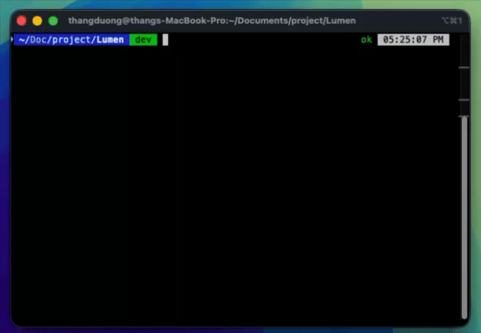

<div align="center">


# Lumen

**Deterministic command suggestions for Zsh — inline, on demand, no AI round-trip required.**

[](LICENSE) [](https://www.swift.org) [](shell/zsh/lumen.plugin.zsh) [](#platform-support)

[Features](#features) · [Usage](#usage--keybindings) · [Tool Coverage](#tool-coverage) · [Installation](#installation) · [Uninstalling](#uninstalling) · [Building from Source](#building-from-source)

</div>

---

## Overview

<div align="center">

As you type in Zsh (or on Ctrl-Space), Lumen matches the current buffer against known,
hand-picked data — a tool's subcommands and flags, `cd` targets, your repo's real git branches —
and renders the result as a floating panel next to your terminal cursor. Two pieces work
together: the **Zsh plugin** (`shell/zsh/`) computes every suggestion; the **`Lumen` menu bar
app** (`Lumen/`, Swift) draws them. There's no AI provider, no daemon, and no network round-trip
anywhere in this path — every suggestion resolves instantly from a static table or a local
command (`git for-each-ref`, a directory glob, `docker ps`, ...).

</div>



## Features

| | |
|---|---|
| **Inline suggestion panel** | Candidates render as a small floating card positioned against your terminal cursor — nothing appears unless you're actively typing or ask for it. Automatic as-you-type suggestions by default, or Ctrl-Space to ask immediately. |
| **Scrollable, mouse-aware** | Up to 5 rows show at once; longer lists scroll instead of growing the panel indefinitely. Hover to highlight, click a row to accept it directly — no need to step through with Up/Down first. |
| **Suggestion chaining** | Accepting a suggestion immediately shows what typically comes next — e.g. picking `git add ` immediately offers file paths, instead of going silent until your next keystroke. |
| **Deep tool coverage** | git, docker, kubectl (`k`), npm/yarn/pnpm, aws, gcloud, terraform (`tf`), helm, gh, glab, and more resolve real subcommands *and* flags from static tables — including the dangerous ones people actually reach for: `git push --force-with-lease`, `docker rm -f`, `kubectl delete --grace-period=0`. See [Tool Coverage](#tool-coverage). |
| **Reads what's actually on your machine** | Real local git branches/remotes/stashes/staged files, real docker containers/images/networks/volumes, real script/task names from `package.json`/`Makefile`/`Justfile`/`Rakefile`/etc — all read fresh every time, never cached or guessed. |
| **Smart `rm` cleanup suggestions** | Typing `rm -rf` (or `-r`/`-f`) suggests common build artifacts, dependencies, and caches to delete — `node_modules`, `.build`, `dist`, `__pycache__`, and 40+ more — tagged `[exists]` when actually present in the current directory. |
| **Case-insensitive `cd` completion** | Typing `cd p` suggests `projects/`, `Pictures/`, `Personal/` regardless of case; accepting drills into that directory so you can keep completing deeper. |
| **Installed-version awareness** | Real installed versions for `nvm use`/`pyenv global`/`rbenv local`, and real installed formulae for `brew uninstall`/`info`/`link`. |
| **Menu bar control** | Toggle automatic suggestions on/off from the menu bar; the state syncs to every open shell via a shared file. Manual Ctrl-Space always works regardless of the toggle. |

## Usage / Keybindings

| Key | Action |
|---|---|
| `Ctrl-Space` (rebindable via `LUMEN_KEY`) | Ask immediately for the current buffer |
| `Up` / `Down` | Cycle through candidates (falls back to normal history search when nothing is showing) |
| `Tab` / `→` (at end of line) / `Enter` | Accept the shown suggestion |
| Click a row | Select and accept that candidate directly |
| `Ctrl-G` / `Escape` | Dismiss the current suggestion, keeps what you typed |

Configurable via environment variables set **before** sourcing the plugin in `.zshrc`:

| Variable | Default | What it does |
|---|---|---|
| `LUMEN_AUTO` | `1` | Automatic as-you-type suggestions. Set to `0` for manual-only (Ctrl-Space). |
| `LUMEN_KEY` | Ctrl-Space | Manual-trigger keybinding. Set to a different Ctrl-key combo to rebind (e.g. Ctrl-T). |
| `LUMEN_OVERLAY` | `1` | Shows the floating panel. Set to `0` to disable Lumen's display entirely. |

**Note:** matching always happens regardless of these settings — `LUMEN_OVERLAY=0` (or
`Lumen.app` not running / lacking Accessibility permission) just means nothing renders; typing
itself is never blocked.

## Tool Coverage

All from static, hand-picked tables in `lumen.plugin.zsh` — not exhaustive, just the
common-case fast path per tool. Anywhere a specific flag table doesn't exist yet, typing `-`
falls back to a generic flag set (`-h`/`--help`, `--version`, `-v`/`--verbose`, `--dry-run`, ...)
instead of showing nothing.

| | |
|---|---|
| **Deep (subcommands + real flags)** | git, docker, kubectl (`k`), npm, yarn, pnpm, aws, gcloud, terraform (`tf`), helm, gh, glab, vagrant, cargo, pulumi, systemctl |
| **Top-level (subcommands only)** | az, kafka-topics (+ console-producer/consumer, consumer-groups), rabbitmqctl, go, pip, poetry, mvn, gradle, dotnet, bundle, gem, brew, heroku, vercel, netlify, firebase, flyctl (`fly`), doctl, turbo, nx, tmux, nvm, pyenv, rbenv |
| **Live from your machine, never a static guess** | `cd` targets, git branches/remotes/stashes/staged files, docker containers/images/networks/volumes, script/task names from `package.json`, `composer.json`, Deno tasks, `Makefile`, `Justfile`, `Rakefile` (via `rake -T`), `Taskfile.yml`, `turbo.json`, Poetry's `pyproject.toml` — plus `rm -rf` cleanup targets and `cp`/`mv`/`ln`/`kill` path/PID completion |

## Platform Support

| Capability | macOS | Linux | Windows |
|---|---|---|---|
| Zsh plugin (matching) | ✅ | ✅ untested — [see plan](ubuntu-support-plan.md) | — |
| Floating panel (`Lumen.app`) | ✅ | ❌ not built | ❌ not built |

**macOS only, currently.** The Zsh plugin itself is portable POSIX shell — Linux should work for
matching — but the panel-drawing app is a SwiftUI/AppKit menu bar app with macOS-only
Accessibility-API cursor positioning, so Lumen has nowhere to render suggestions on Linux or
Windows yet. See [`ubuntu-support-plan.md`](ubuntu-support-plan.md) for what a Linux port would
take (short version: the shell/IPC layers need no change, the overlay app needs a GTK rewrite,
and Wayland's window-positioning restrictions are the biggest open risk). Bash and Fish shells
are not supported on any platform — Lumen is built on Zsh's line editor (ZLE).

## Installation

Lumen currently supports **macOS 13+ with Zsh only** (see [Platform Support](#platform-support)).
Two pieces, both required:

### 1. Zsh plugin

```sh
git clone https://github.com/thangduonghuu/lumen.git ~/lumen
echo 'source ~/lumen/shell/zsh/lumen.plugin.zsh' >> ~/.zshrc && source ~/.zshrc
```

Suggestions are now being *computed* correctly — you just have nowhere to see them yet.

### 2. Menu bar app

**Download a prebuilt build:**

1. Grab the latest `Lumen.dmg` from the [Releases page](https://github.com/thangduonghuu/lumen/releases).
2. Open the `.dmg` and drag **Lumen.app** into `/Applications`, then open it.
3. Lumen isn't code-signed with a paid Apple Developer ID, so Gatekeeper blocks it on the first
   launch. Right-click **Lumen.app** → **Open** (instead of double-clicking) and confirm — only
   needed once.

If no release is available yet, or you want the latest unreleased changes, build from source
instead (below).

### 3. Grant Accessibility permission

The first launch triggers macOS's permission prompt automatically. If missed: **System Settings
→ Privacy & Security → Accessibility**, enable **Lumen** (or add `Lumen.app` via **+**), then
quit and relaunch. Without this, the plugin still matches correctly — it just has nowhere to draw
the result.

**Every rebuild invalidates this grant** (the ad-hoc code signature changes each build) —
re-grant it after each rebuild, not just the first one.

Doesn't auto-start on login by default — add it under **System Settings → General → Login
Items** if you want that.

## Building from Source

### Prerequisites

- macOS 13+ with Zsh
- [Swift 5.9+](https://www.swift.org) / Xcode command line tools (`xcode-select --install`)

### Build

```sh
cd Lumen
./build.sh
open Lumen.app
```

<details>
<summary><strong>What <code>build.sh</code> does</strong></summary>

1. `swift build -c release` — compiles the executable.
2. Packages it as a real `.app` bundle (`Contents/MacOS/Lumen`).
3. Generates `Contents/Info.plist` from scratch every run (bundle identifier, `LSUIElement` for
   menu-bar-only, icon reference) — the bundle is fully reproducible from this script alone.
4. Copies the app icon and the bundled per-tool brand SVGs into the bundle.
5. Re-signs the bundle with an ad-hoc code signature (`codesign --force --deep --sign -` — no
   paid Apple Developer ID needed for local use).

</details>

For a fully clean rebuild:

```sh
rm -rf .build Lumen.app
./build.sh
```

## Uninstalling

1. Quit `Lumen.app` if it's running.
2. Remove the app:

   ```sh
   rm -rf /Applications/Lumen.app
   ```

   (or drag it from `/Applications` to the Trash in Finder).
3. Remove the `source ~/lumen/shell/zsh/lumen.plugin.zsh` line added to `~/.zshrc` during setup.
4. Optional — also remove Lumen's cache and config (socket, enabled-state, overlay position
   calibration):

   ```sh
   rm -rf ~/.cache/lumen ~/.config/lumen
   ```

## Troubleshooting

**Panel not showing up:**
1. Is `Lumen.app` running? (menu bar icon — ✨ enabled, ⏸ paused)
2. Is Accessibility permission granted? Most common cause, especially right after a rebuild —
   see [Installation](#installation).
3. Check the log:

   ```sh
   tail -f /tmp/lumen-overlay-debug.log
   ```

   Watch for `AXIsProcessTrusted=false` (permission not granted) or `no focused window/element`
   (permission granted, but that app doesn't expose enough via Accessibility for precise
   positioning).

## Contributing

See [CONTRIBUTING.md](CONTRIBUTING.md).

## License

[MIT](LICENSE)
